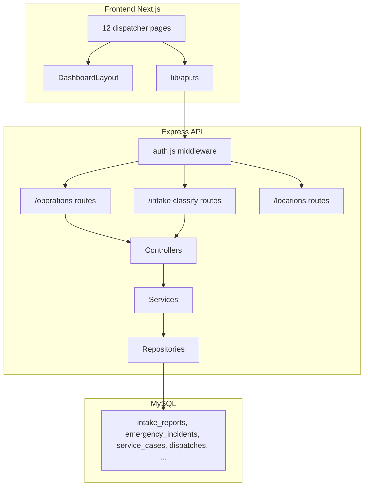
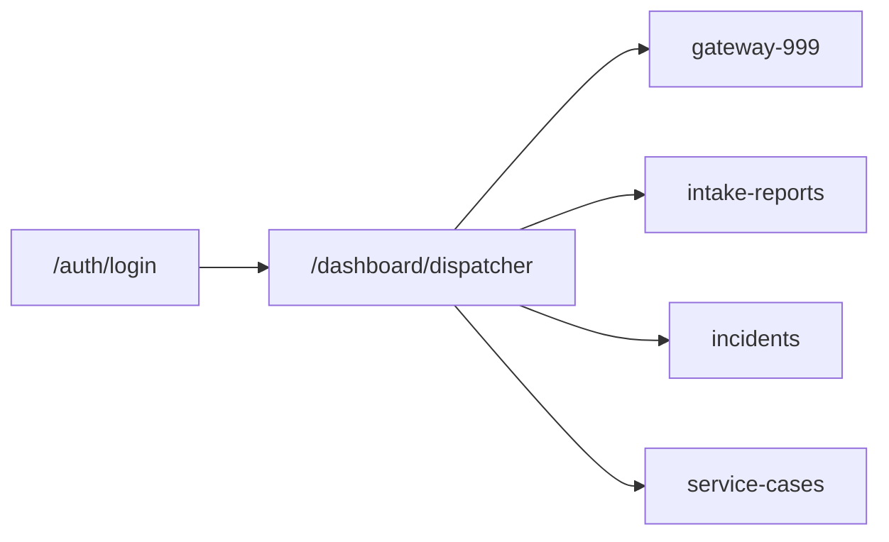
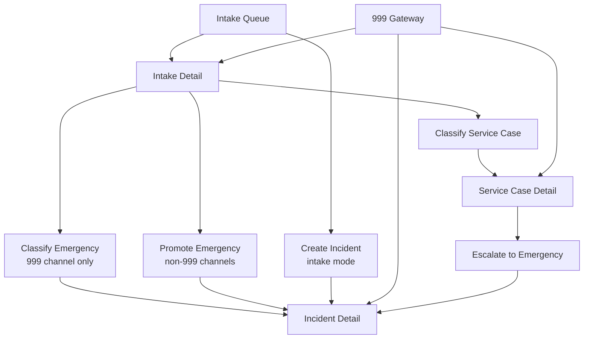
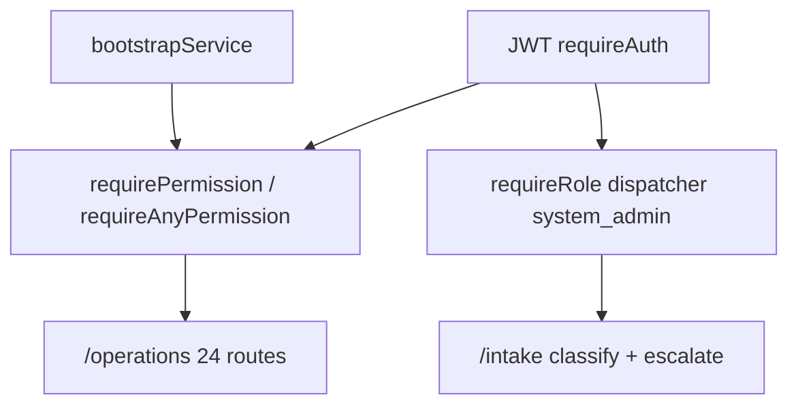

# Dispatcher Dashboard — Architecture & Reference

This document describes the full structure of the NIERS **dispatcher dashboard**: routes, features, frontend/backend file chains, API endpoints, authorization, database tables, and known gaps.

**Related docs:** [README.md](./README.md) (docs index) · [backend-api.md](./backend-api.md) (request/response schemas for Operations and Intake APIs).

---

## Table of contents

1. [Overview](#overview)
2. [Architecture](#architecture)
3. [Access & authentication](#access--authentication)
4. [Navigation & shell](#navigation--shell)
5. [Feature areas](#feature-areas)
6. [Workflow diagrams](#workflow-diagrams)
7. [API reference (dispatcher)](#api-reference-dispatcher)
8. [Authorization model](#authorization-model)
9. [Database tables](#database-tables)
10. [File inventory](#file-inventory)
11. [Conventions & known gaps](#conventions--known-gaps)

---

## Overview

The dispatcher dashboard is the operational console for emergency and non-emergency report handling. It is implemented as:

| Layer | Technology | Location |
|-------|------------|----------|
| Frontend | Next.js App Router (client pages) | `frontend/app/dashboard/dispatcher/` |
| Shared UI | React components | `frontend/components/` |
| Backend | Express + repositories (no ORM) | `backend/src/api/`, `backend/src/services/`, `backend/src/repositories/` |
| API mounts | `/operations`, `/intake`, `/locations` | `backend/src/app.js` |

There is **no** dedicated `components/dispatcher/` folder. Each page is self-contained and composes shared primitives (`DashboardLayout`, `LocationPicker`, UI kit).

**Roles with access:** `dispatcher`, `system_admin` (admin also sees dispatcher nav plus Admin).

**Entry after login:** `/dashboard/dispatcher` (see `frontend/lib/auth-store.ts` → `getDashboardUrl`).

---

## Architecture

**Data flow (typical page):**

1. Page checks session (`ensureAuthSession` or `useAuthGuard`).
2. Page calls `apiGet` / `apiPost` / `apiPatch` from `frontend/lib/api.ts`.
3. Request hits Express route with `requireAuth` + permission/role checks.
4. Controller delegates to service → repository → SQL.
5. JSON response rendered in page UI.

---

## Access & authentication

### Login

| Item | Detail |
|------|--------|
| Route | `/auth/login` |
| Files | `frontend/app/auth/login/page.tsx`, `frontend/components/auth/LoginForm.tsx` |
| API | `POST /auth/login` |
| Redirect | Role `dispatcher` → `/dashboard/dispatcher` |

### Session storage

| Key / module | Purpose |
|--------------|---------|
| `frontend/lib/auth-store.ts` | `saveAuthSession`, `getAuthSession`, `clearAuthSession`, `getDashboardUrl`, `UserRole` |
| `frontend/lib/api.ts` | JWT in requests, `ensureAuthSession`, `ApiError` |
| `sessionStorage.loggedInUser` | User display + role codes (overview and manual auth pages) |

### Auth patterns on dispatcher pages

| Pattern | Pages using it |
|---------|----------------|
| Manual `ensureAuthSession()` + `sessionStorage` | Overview, intake list/detail, classify/promote, incidents list/detail/create |
| `useAuthGuard(["dispatcher", "system_admin"])` | 999 Gateway, service-cases list, service-cases detail |

### Dispatcher role permissions (bootstrap)

Granted in `backend/src/services/bootstrapService.js` to role `dispatcher`:

- `incident.create`, `incident.classify`, `incident.assign_agency`, `incident.update_status`
- `dispatch.create`, `dispatch.update_status`
- `case.create`, `case.respond`, `case.assign`, `case.escalate`

`system_admin` receives all permissions.

---

## Navigation & shell

### Sidebar (`DashboardLayout`)

File: `frontend/components/dashboard/DashboardLayout.tsx`

| Nav label | Route |
|-----------|-------|
| Overview | `/dashboard/dispatcher` |
| 999 Gateway | `/dashboard/dispatcher/gateway-999` |
| Intake Queue | `/dashboard/dispatcher/intake-reports` |
| Service Cases | `/dashboard/dispatcher/service-cases` |
| Incidents | `/dashboard/dispatcher/incidents` |
| Profile | `/dashboard/profile` |

`system_admin` also sees **Roles** → `/dashboard/admin`.

### Shared infrastructure

| Component / lib | File | Used for |
|-----------------|------|----------|
| Health badge | `frontend/components/HealthBadge.tsx` | `GET /health` in header |
| Location picker | `frontend/components/location/LocationPicker.tsx` | Map pin, search, reverse geocode |
| Datetime (BD) | `frontend/lib/datetime.ts` | Gateway, classify, promote forms |
| UI kit | `frontend/components/ui/*` | Badge, Button, Card, ConfirmModal, ErrorAlert, Input, LoadingSkeleton, StatusState |
| Root layout | `frontend/app/layout.tsx` | Leaflet CSS for maps |

---

## Feature areas

### 1. Operations overview

| | |
|--|--|
| **Route** | `/dashboard/dispatcher` |
| **Page** | `frontend/app/dashboard/dispatcher/page.tsx` |
| **API** | `GET /operations/dispatcher/overview` |
| **Permission** | `incident.classify` |

**Backend chain:**

`backend/src/api/routes/operations.js`  
→ `backend/src/api/controllers/operationsDispatcherOverview.js`  
→ `backend/src/services/dispatcherOverviewService.js`  
→ `operationsIntakeRepo.js`, `incidentOperationsRepo.js`, `operationsServiceCaseRepo.js`

**Types:** `frontend/types/operations-overview.ts`

**Behavior:**

- Dashboard counts: pending intakes, active incidents, open service cases.
- Recent activity feed (API returns up to 15 merged items; UI shows subset).
- Quick links to Intake Queue, Service Cases, Incidents.
- Per recent intake row: open detail, or **Create Incident** with `?mode=intake&intakeReportPublicUuid=...`.

**Count semantics (backend):**

- Pending intakes: `intake_status` in `received`, `under_review`
- Active incidents: current status `is_terminal = false`
- Open service cases: current status `is_terminal = false`

---

### 2. 999 Gateway

| | |
|--|--|
| **Route** | `/dashboard/dispatcher/gateway-999` |
| **Page** | `frontend/app/dashboard/dispatcher/gateway-999/page.tsx` |
| **Auth** | `useAuthGuard(["dispatcher", "system_admin"])` |
| **API** | `POST /operations/gateway/999/intake-and-incident` |
| **Permission** | `incident.classify` |

**Backend chain:**

`operationsIncidents.js` → `intakeService.js` → `intakeRepo.js`, `intakeGatewayRepo.js`

**Behavior:**

- Single form: caller info, call timing, category/summary, map location (`LocationPicker`).
- Disposition: `service_case` or `emergency_incident`.
- Atomic creation of intake + downstream entity.
- Success screen links to created intake, incident, or service case.

---

### 3. Intake queue & triage

#### 3a. Intake list

| | |
|--|--|
| **Route** | `/dashboard/dispatcher/intake-reports` |
| **Page** | `frontend/app/dashboard/dispatcher/intake-reports/page.tsx` |
| **API** | `GET /operations/intake-reports` |
| **Permission** | `incident.classify` |

**Backend:** `operationsIntakeReports.js` → `incidentOperationsService.js` → `operationsIntakeRepo.js`

**Types:** `frontend/types/operations-intake.ts`

**Behavior:** Paginated queue with filters (`intake_status`, `urgency_type`, `categoryCode`, `sort`). Actions: view detail, create incident (intake mode).

#### 3b. Intake detail

| | |
|--|--|
| **Route** | `/dashboard/dispatcher/intake-reports/[reportPublicUuid]` |
| **Page** | `frontend/app/dashboard/dispatcher/intake-reports/[reportPublicUuid]/page.tsx` |

| API | Permission / access |
|-----|-------------------|
| `GET /operations/intake-reports/:uuid` | `incident.classify` |
| `GET /operations/intake-reports/:uuid/reported-location-history` | `incident.classify` |
| `PATCH /intake/reports/:uuid/location` | Auth; repo allows dispatcher → `location.source = dispatcher_selected` |

**Types:** `frontend/types/intake.ts`

**Behavior:** Metadata, badges, disposition. CTAs: classify service case, classify emergency (999 channel), promote emergency (other channels). Map location update + history timeline.

#### 3c. Classify emergency (999 channel)

| | |
|--|--|
| **Route** | `.../intake-reports/[uuid]/classify/emergency` |
| **Page** | `frontend/app/dashboard/dispatcher/intake-reports/[reportPublicUuid]/classify/emergency/page.tsx` |
| **API** | `POST /intake/reports/:uuid/classify/emergency` |
| **Auth** | `requireRole("dispatcher", "system_admin")` |

**Backend:** `intake.js` → `intakeService.js` → `intakeGatewayRepo.js`

**Behavior:** For `channel_code === "emergency_call"`. Collects severity, title, description, caller phone, Bangladesh-local datetimes. Creates `emergency_calls` (with `dispatcher_id`) and `emergency_incidents`.

#### 3d. Classify service case

| | |
|--|--|
| **Route** | `.../classify/service-case` |
| **Page** | `frontend/app/dashboard/dispatcher/intake-reports/[reportPublicUuid]/classify/service-case/page.tsx` |
| **API** | `POST /intake/reports/:uuid/classify/service-case` |
| **Auth** | `requireRole("dispatcher", "system_admin")` |

**Behavior:** Title, description, priority → new `service_cases` row (status `submitted`). Redirects to service case detail.

#### 3e. Promote to emergency

| | |
|--|--|
| **Route** | `.../promote/emergency` |
| **Page** | `frontend/app/dashboard/dispatcher/intake-reports/[reportPublicUuid]/promote/emergency/page.tsx` |
| **API** | `POST /operations/intake-reports/:uuid/promote/emergency` |
| **Permissions** | `incident.create` AND `incident.classify` |

**Backend:** `operationsIncidents.js` → `incidentOperationsRepo.js`

**Behavior:** Promotes non–999-call intake to emergency incident without full `emergency_calls` record.

---

### 4. Incidents

#### 4a. Incident list

| | |
|--|--|
| **Route** | `/dashboard/dispatcher/incidents` |
| **Page** | `frontend/app/dashboard/dispatcher/incidents/page.tsx` |
| **API** | `GET /operations/incidents` |
| **Permissions** | `incident.create` OR `incident.update_status` |

**Behavior:** Filters (status, category, severity, date range), pagination, link to create incident.

#### 4b. Create incident

| | |
|--|--|
| **Route** | `/dashboard/dispatcher/incidents/create-incident` |
| **Page** | `frontend/app/dashboard/dispatcher/incidents/create-incident/page.tsx` |
| **API** | `POST /operations/incidents` |
| **Permission** | `incident.create` |

**Modes:**

| Mode | Query | Required fields |
|------|-------|-----------------|
| Standalone | default | category, title, map location |
| From intake | `?mode=intake&intakeReportPublicUuid=<uuid>` | links existing intake |

#### 4c. Incident detail

| | |
|--|--|
| **Route** | `/dashboard/dispatcher/incidents/[incidentPublicUuid]` |
| **Page** | `frontend/app/dashboard/dispatcher/incidents/[incidentPublicUuid]/page.tsx` |

| API | Permission |
|-----|------------|
| `GET /operations/incidents/:uuid` | `incident.create` OR `incident.update_status` |
| `PATCH /operations/incidents/:uuid/status` | `incident.update_status` |
| `POST /operations/incidents/:uuid/notes` | `incident.update_status` |
| `POST /operations/incidents/:uuid/intake-reports` | `incident.create` OR `incident.update_status` |
| `GET /operations/intake-reports` | `incident.classify` (recent intakes sidebar) |

**Backend:** `incidentOperationsRepo.js`, `lib/statusWorkflow.js`, `notificationService.js`

**Behavior:** Incident card, linked intakes, timeline preview. Workflow-validated status transitions (optional `outcomeCode` on terminal states). Operator notes. Link intake modal + quick-link from sidebar. Edits blocked when incident is terminal.

**Backend-only (no UI yet):** agency assignment, available units, create/patch dispatch, agency workload, response timing (see [API reference](#api-reference-dispatcher)).

---

### 5. Service cases

#### 5a. Service case list

| | |
|--|--|
| **Route** | `/dashboard/dispatcher/service-cases` |
| **Page** | `frontend/app/dashboard/dispatcher/service-cases/page.tsx` |
| **Auth** | `useAuthGuard` |
| **API** | `GET /operations/service-cases` |
| **Permission** | `case.respond` |

**Behavior:** Filters (status, category), pagination.

#### 5b. Service case detail

| | |
|--|--|
| **Route** | `/dashboard/dispatcher/service-cases/[publicUuid]` |
| **Page** | `frontend/app/dashboard/dispatcher/service-cases/[publicUuid]/page.tsx` |
| **Auth** | `useAuthGuard` |

| API | Permission |
|-----|------------|
| `GET /operations/service-cases/:uuid` | `case.respond` |
| `PATCH /operations/service-cases/:uuid/status` | `case.respond` |
| `POST /operations/service-cases/:uuid/messages` | `case.respond` |
| `POST /operations/service-cases/:uuid/assignments` | `case.assign` |
| `POST /operations/service-cases/:uuid/resolve` | `case.respond` |
| `POST /intake/reports/:intakeUuid/escalate` | Role + `case.escalate` + `incident.create` |

**Types:** `frontend/types/service-case.ts`

**Behavior:** Read case, messages, status history, assignments, resolution. When not terminal: update status, assign user (by public UUID), dispatcher message, resolve, escalate to emergency incident.

---

## Workflow diagrams

### Intake triage paths

### Paths from intake to incident

| Path | Trigger | API |
|------|---------|-----|
| Classify emergency | Intake detail → 999 channel | `POST /intake/reports/:uuid/classify/emergency` |
| Promote emergency | Intake detail → non-999 channel | `POST /operations/intake-reports/:uuid/promote/emergency` |
| Create incident | Queue/overview → create page | `POST /operations/incidents` (intake mode) |
| Gateway 999 | Gateway form, emergency disposition | `POST /operations/gateway/999/intake-and-incident` |
| Escalate | Service case detail | `POST /intake/reports/:uuid/escalate` |

---

## API reference (dispatcher)

All protected routes require header: `Authorization: Bearer <access_token>`.

Base URL: `NEXT_PUBLIC_API_BASE_URL` (frontend).

### Operations (`/operations`)

| Method | Path | Permission(s) | Frontend consumer |
|--------|------|---------------|-------------------|
| GET | `/dispatcher/overview` | `incident.classify` | Overview |
| GET | `/intake-reports` | `incident.classify` | Intake list, incident detail sidebar |
| GET | `/intake-reports/:uuid` | `incident.classify` | Classify/promote pages, intake detail |
| GET | `/intake-reports/:uuid/reported-location-history` | `incident.classify` | Intake detail |
| POST | `/intake-reports/:uuid/promote/emergency` | `incident.create` + `incident.classify` | Promote emergency |
| POST | `/gateway/999/intake-and-incident` | `incident.classify` | 999 Gateway |
| POST | `/incidents` | `incident.create` | Create incident |
| GET | `/incidents` | `incident.create` OR `incident.update_status` | Incidents list |
| GET | `/incidents/:uuid` | same | Incident detail |
| PATCH | `/incidents/:uuid/status` | `incident.update_status` | Incident detail |
| POST | `/incidents/:uuid/notes` | `incident.update_status` | Incident detail |
| POST | `/incidents/:uuid/intake-reports` | `incident.create` OR `incident.update_status` | Incident detail |
| POST | `/incidents/:uuid/agencies` | `incident.assign_agency` | **No UI** |
| GET | `/units/available` | `dispatch.create` | **No UI** |
| POST | `/incidents/:uuid/dispatches` | `dispatch.create` | **No UI** |
| PATCH | `/dispatches/:uuid/status` | `dispatch.update_status` | **No UI** |
| GET | `/agencies/workload` | `dispatch.create` OR `incident.assign_agency` | **No UI** |
| GET | `/incidents/:uuid/response-timing` | `dispatch.create` OR `incident.assign_agency` | **No UI** |
| GET | `/service-cases` | `case.respond` | Service cases list |
| GET | `/service-cases/:uuid` | `case.respond` | Service case detail |
| GET | `/service-cases/:uuid/messages` | `case.respond` | (available; detail may embed messages) |
| PATCH | `/service-cases/:uuid/status` | `case.respond` | Service case detail |
| POST | `/service-cases/:uuid/messages` | `case.respond` | Service case detail |
| POST | `/service-cases/:uuid/assignments` | `case.assign` | Service case detail |
| POST | `/service-cases/:uuid/resolve` | `case.respond` | Service case detail |

**Route file:** `backend/src/api/routes/operations.js`  
**Dispatch controller:** `backend/src/api/controllers/operationsDispatch.js`  
**Dispatch service/repo:** `dispatchOperationsService.js`, `dispatchOperationsRepo.js`

### Intake — operator triage (`/intake`)

| Method | Path | Auth | Frontend consumer |
|--------|------|------|-------------------|
| POST | `/reports/:uuid/classify/service-case` | Role: dispatcher, system_admin | Classify service case |
| POST | `/reports/:uuid/classify/emergency` | Role: dispatcher, system_admin | Classify emergency |
| POST | `/reports/:uuid/escalate` | Role + `case.escalate` + `incident.create` | Service case detail |
| PATCH | `/reports/:uuid/location` | Auth; repo allows dispatcher | Intake detail |
| GET | `/reports/:uuid/reported-location-history` | Auth; repo allows dispatcher | Intake detail |

**Route file:** `backend/src/api/routes/intake.js`

### Supporting APIs

| Method | Path | Used by |
|--------|------|---------|
| POST | `/auth/login` | Login |
| GET | `/users/me` | Profile |
| GET | `/health` | HealthBadge |
| GET | `/locations/search` | LocationPicker |
| GET | `/locations/reverse` | LocationPicker |

---

## Authorization model

| Permission | UI features | Notes |
|------------|-------------|-------|
| `incident.classify` | Overview, intake queue/detail, gateway 999 | |
| `incident.create` | Create incident, promote emergency, gateway emergency path | |
| `incident.update_status` | Incident status, notes, link intake | |
| `incident.assign_agency` | — | API only |
| `dispatch.create` | — | API only |
| `dispatch.update_status` | — | API only |
| `case.respond` | Service case queue & operations | |
| `case.assign` | Assign service case | |
| `case.escalate` | Escalate to emergency | With role check on route |

**Middleware:** `backend/src/api/middlewares/auth.js`  
**RBAC:** `backend/src/services/rbacService.js`, `backend/src/repositories/rbacRepo.js`

Explicit `requireRole("dispatcher", "system_admin")` applies only to the three intake classify/escalate routes. Other `/operations` routes rely on permissions (any user with grants, including `system_admin`, may call them).

---

## Database tables

Schema files: `backend/src/schemas/docker-init/`

| Domain | Tables |
|--------|--------|
| RBAC | `users`, `user_profiles`, `roles`, `permissions`, `role_permissions`, `user_roles` |
| Geography | `locations`, `administrative_areas` |
| Intake | `intake_reports`, `intake_statuses`, `intake_report_location_history`, `intake_report_status_history`, `report_channels`, `report_categories` |
| 999 | `emergency_calls` (`dispatcher_id`), `emergency_call_notes`, `emergency_call_triage_answers` |
| Incidents | `emergency_incidents`, `incident_statuses`, `incident_report_links`, `incident_timeline_events`, `incident_agency_participation`, `incident_status_history` |
| Dispatch | `dispatches`, `dispatch_statuses`, `dispatch_status_history`, `emergency_units`, `unit_statuses`, `agencies` |
| Service cases | `service_cases`, `case_messages`, `case_assignments`, `case_resolutions`, `case_escalations`, `case_status_history` |
| Notifications | `notifications`, `notification_recipients`, `email_outbox` |
| Audit | `audit_logs` |

### SQL views

| View | Exposed via API | Purpose |
|------|-----------------|---------|
| `vw_agency_workload` | `GET /operations/agencies/workload` | Per-agency workload (no UI) |
| `vw_response_pipeline_timing` | `GET /operations/incidents/:id/response-timing` | Pipeline timing (no UI) |
| `vw_dispatcher_performance` | None | Analytics by `emergency_calls.dispatcher_id` |

### Schema not exposed via REST

- `operator_shifts`, `operator_queue_assignments` (`12_operator_workload.sql`)

---

## File inventory

### Frontend — dispatcher pages (12)

| # | Path |
|---|------|
| 1 | `frontend/app/dashboard/dispatcher/page.tsx` |
| 2 | `frontend/app/dashboard/dispatcher/gateway-999/page.tsx` |
| 3 | `frontend/app/dashboard/dispatcher/intake-reports/page.tsx` |
| 4 | `frontend/app/dashboard/dispatcher/intake-reports/[reportPublicUuid]/page.tsx` |
| 5 | `frontend/app/dashboard/dispatcher/intake-reports/[reportPublicUuid]/classify/emergency/page.tsx` |
| 6 | `frontend/app/dashboard/dispatcher/intake-reports/[reportPublicUuid]/classify/service-case/page.tsx` |
| 7 | `frontend/app/dashboard/dispatcher/intake-reports/[reportPublicUuid]/promote/emergency/page.tsx` |
| 8 | `frontend/app/dashboard/dispatcher/incidents/page.tsx` |
| 9 | `frontend/app/dashboard/dispatcher/incidents/create-incident/page.tsx` |
| 10 | `frontend/app/dashboard/dispatcher/incidents/[incidentPublicUuid]/page.tsx` |
| 11 | `frontend/app/dashboard/dispatcher/service-cases/page.tsx` |
| 12 | `frontend/app/dashboard/dispatcher/service-cases/[publicUuid]/page.tsx` |

### Frontend — shell, auth, libs, types

| Category | Files |
|----------|-------|
| Entry | `frontend/app/auth/login/page.tsx`, `frontend/components/auth/LoginForm.tsx`, `frontend/components/auth/LoginCard.tsx` |
| Shell | `frontend/components/dashboard/DashboardLayout.tsx`, `frontend/components/HealthBadge.tsx`, `frontend/app/layout.tsx` |
| Location | `frontend/components/location/LocationPicker.tsx` |
| UI kit | `frontend/components/ui/Badge.tsx`, `Button.tsx`, `Card.tsx`, `ConfirmModal.tsx`, `ErrorAlert.tsx`, `Input.tsx`, `LoadingSkeleton.tsx`, `StatusState.tsx` |
| Libs | `frontend/lib/api.ts`, `auth-store.ts`, `use-auth-guard.ts`, `datetime.ts` |
| Types | `frontend/types/operations-overview.ts`, `operations-intake.ts`, `intake.ts`, `service-case.ts`, `auth.ts` |
| Profile | `frontend/app/dashboard/profile/page.tsx` |
| Global | `frontend/components/SonnerToaster.tsx` |

**Note:** Incident TypeScript types are defined inline in incident pages, not in `frontend/types/`.

### Backend — routes

| File | Mount |
|------|-------|
| `backend/src/app.js` | App entry, route mounting |
| `backend/src/api/routes/operations.js` | `/operations` |
| `backend/src/api/routes/intake.js` | `/intake` |
| `backend/src/api/routes/locations.js` | `/locations` |
| `backend/src/api/routes/auth.js` | `/auth` |
| `backend/src/api/routes/users.js` | `/users` |

### Backend — controllers (dispatcher-related)

| File |
|------|
| `backend/src/api/controllers/operationsDispatcherOverview.js` |
| `backend/src/api/controllers/operationsIntakeReports.js` |
| `backend/src/api/controllers/operationsIncidents.js` |
| `backend/src/api/controllers/operationsDispatch.js` |
| `backend/src/api/controllers/operationsServiceCases.js` |
| `backend/src/api/controllers/intake.js` |
| `backend/src/api/controllers/intakeServiceCases.js` |
| `backend/src/api/controllers/locations.js` |

### Backend — services

| File |
|------|
| `backend/src/services/dispatcherOverviewService.js` |
| `backend/src/services/incidentOperationsService.js` |
| `backend/src/services/dispatchOperationsService.js` |
| `backend/src/services/serviceCaseOperationsService.js` |
| `backend/src/services/intakeService.js` |
| `backend/src/services/notificationService.js` |
| `backend/src/services/locationService.js` |
| `backend/src/services/bootstrapService.js` |
| `backend/src/services/rbacService.js` |

### Backend — repositories

| File |
|------|
| `backend/src/repositories/operationsIntakeRepo.js` |
| `backend/src/repositories/incidentOperationsRepo.js` |
| `backend/src/repositories/dispatchOperationsRepo.js` |
| `backend/src/repositories/serviceCaseOperationsRepo.js` |
| `backend/src/repositories/operationsServiceCaseRepo.js` |
| `backend/src/repositories/intakeRepo.js` |
| `backend/src/repositories/intakeGatewayRepo.js` |
| `backend/src/repositories/locationRepo.js` |

### Backend — shared

| File | Role |
|------|------|
| `backend/src/api/middlewares/auth.js` | JWT, permissions, roles |
| `backend/src/lib/statusWorkflow.js` | Status transition validation |
| `backend/src/api/validators/operations.js` | Operations request validation |
| `backend/src/api/validators/operationsDispatch.js` | Dispatch validation |
| `backend/src/api/validators/serviceCases.js` | Service case validation |
| `backend/src/api/validators/intake.js` | Intake validation |

---

## Conventions & known gaps

### Conventions

- **No React Context** for dispatcher state; each page fetches data independently on mount.
- **Page-local state** with `useState` / `useEffect` / `useCallback`.
- **Confirm flows** use `ConfirmModal` before destructive or irreversible classify/status actions.
- **Map pages** dynamically import `LocationPicker` with `ssr: false`.
- **Timestamps** for operator forms use Bangladesh local input converted to ISO via `datetime.ts`.

### Known gaps

| Gap | Detail |
|-----|--------|
| Dispatch UI missing | Backend supports agencies, units, dispatches, workload, response timing; no dispatcher pages call these endpoints |
| Auth inconsistency | Mix of manual session checks and `useAuthGuard` |
| No shared hooks | No `useDispatcherOverview` etc.; duplicated fetch logic |
| Incident types | Not centralized in `frontend/types/` |
| Operator workload tables | `operator_shifts`, `operator_queue_assignments` exist in schema but have no REST routes |
| Dispatcher performance view | `vw_dispatcher_performance` in DB only |

### Future work (suggested)

1. Add incident detail sections for agency assignment and unit dispatch (wire existing `/operations` dispatch routes).
2. Standardize auth with `useAuthGuard` on all dispatcher pages.
3. Extract shared types for incidents and optional data-fetch hooks.
4. Expose or build UI for `vw_dispatcher_performance` if analytics are required.

---

*Generated from the dispatcher dashboard structure plan. For HTTP payloads and examples, see [backend-api.md](./backend-api.md).*
